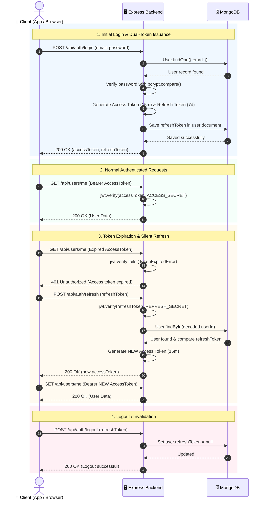
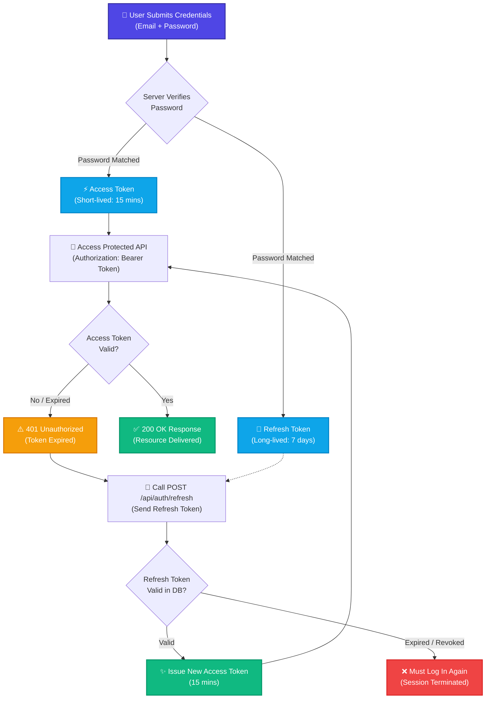

# 🔑 Access Token & Refresh Token

> Guide to token lifecycles, dual-token authentication flows, and token refresh mechanisms.

---

## 1. Access Token

### Definition
An **Access Token** is a short-lived token used by a client to access **protected resources/APIs** after successful authentication.

> **Simple words:** An Access Token proves to the server that the user is authenticated and permitted to access protected APIs.

### Example Flow
```text
Login
  ↓
Email + Password verified
  ↓
Access Token generated
  ↓
Client receives token
  ↓
Client uses token for protected APIs
```

Example request:
```http
GET /api/users/me
Authorization: Bearer <access_token>
```

### Characteristics
* Short-lived token (usually valid for a few minutes).
* Used specifically to access protected APIs.
* Becomes invalid once expired.
* Frequently used across client requests.

---

## 2. Refresh Token

### Definition
A **Refresh Token** is a long-lived token used to obtain a **new Access Token** when the current Access Token expires.

> **Simple words:** The primary job of a Refresh Token is to obtain a new Access Token.

### Example Flow
```text
Access Token expires
        ↓
Client sends Refresh Token
        ↓
Server verifies Refresh Token
        ↓
New Access Token generated
        ↓
Client can access APIs again
```

Example endpoint:
```http
POST /api/auth/refresh
```

### Characteristics
* Long-lived token (valid much longer than the Access Token).
* Not used for normal API requests.
* Used strictly on the refresh endpoint to generate new Access Tokens.
* Must be stored securely.

---

## 3. Access Token vs Refresh Token

| Access Token | Refresh Token |
| :--- | :--- |
| Used for API access | Used to obtain new Access Tokens |
| Short-lived (e.g., 15 minutes) | Long-lived (e.g., 7 days) |
| Frequently used across requests | Occasionally used upon expiration |
| Sent to protected resource routes | Sent exclusively to refresh endpoint |
| Expires quickly | Expires relatively late |

---

## 4. End-to-End Sequence Diagram (Full Lifecycle)



---

## 5. Complete Authentication Flow (Architecture Map)



---

## 6. Why Do We Need Both?

If only a **long-lived Access Token** is used:
```text
Access Token ──► Valid for 7 days
```
If this token is intercepted or leaked, an attacker has unrestricted access for the entire 7 days.

Therefore, the dual-token pattern is used:
```text
Short-lived Access Token (15m) + Long-lived Refresh Token (7d)
```
This minimizes the attack window of the Access Token while keeping the user logged in without repeatedly prompting for credentials.

---

## 7. Frontend Auto-Refresh (Silent Refresh)

* When the backend detects an invalid or expired Access Token, it returns `401 Unauthorized`.
* The frontend intercepts this response, calls the `/api/auth/refresh` endpoint using the stored Refresh Token, receives a new Access Token, and retries the original failed request seamlessly.
