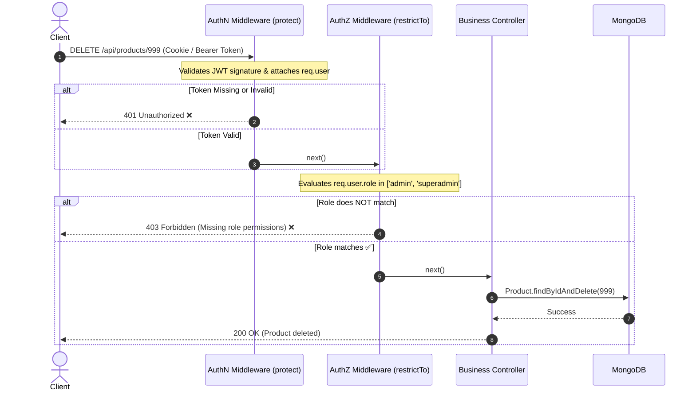

# 🛡️ Role-Based Access Control (RBAC) - Complete Architecture

> **Category:** Backend  
> **Topic:** Authorization  
> **Concept:** Role-Based Access Control (RBAC)  
> **Prerequisites:** Authentication basics, Express.js middleware, HTTP status codes

---

## ⚡ 2-Minute Interview Cheatsheet (TL;DR)

| Concept | Key Technical Point to Mention |
| :--- | :--- |
| **Authorization (AuthZ)** | The process of verifying whether an already-authenticated principal has permission to perform a specific action on a resource. |
| **HTTP Status Code** | **`403 Forbidden`** (RFC 9110: server understands the request and verified identity, but refuses authorization). Distinct from `401 Unauthorized`. |
| **RBAC Mechanism** | Permissions are assigned to **Roles** (e.g. `admin`, `editor`, `user`), and Roles are assigned to **Users**. |
| **Express Pattern** | Higher-order middleware closure: `restrictTo('admin', 'editor')` placed after the `protect` authentication middleware. |
| **BOLA / IDOR Defense** | Role checks are not enough; always verify resource ownership (Object-Level Authorization) via scoped DB queries (`where userId = req.user.id`). |

---

## 1. What is it?

**Role-Based Access Control (RBAC)** is an authorization mechanism where system permissions are grouped into **Roles**, and users are granted roles rather than individual permissions.

```text
  [ User ] ────────► Assigned to ────────► [ Role (e.g., 'admin') ]
                                                    │
                                                    ▼
                                           Inherits Permissions:
                                           ├── product:create
                                           ├── product:update
                                           └── product:delete
```

When an HTTP request arrives, the authorization middleware inspects the authenticated user's role and determines whether that role is authorized to execute the endpoint.

---

## 2. Why do we need it?

1. **Least Privilege Principle:** Ensures users only have the minimal set of privileges necessary to perform their jobs.
2. **Simplified Management:** Assigning 50 granular permissions directly to 10,000 users individually is unmanageable. Grouping permissions into 3–5 roles simplifies auditing.
3. **Defense Against Privilege Escalation:** Prevents standard users from performing administrative actions (e.g. deleting users, accessing financial reports).

---

## 3. How does it work? (The Policy Enforcement Architecture)



---

## 4. Syntax & Basic Structure (Express.js)

```javascript
// Middleware Closure (Higher-Order Function)
const restrictTo = (...allowedRoles) => {
  return (req, res, next) => {
    // req.user was populated by prior authentication middleware
    if (!req.user || !allowedRoles.includes(req.user.role)) {
      return res.status(403).json({
        success: false,
        message: `Forbidden: You do not have permission to perform this action.`
      });
    }
    next();
  };
};

// Route Application
router.delete('/users/:id', protect, restrictTo('admin'), deleteUserController);
```

---

## 5. Practical Implementation (Production MERN Standards)

### A. Role Hierarchy Pattern
In complex apps, higher roles should automatically inherit permissions of lower roles:

```javascript
const roleHierarchy = {
  user: ['user'],
  moderator: ['user', 'moderator'],
  admin: ['user', 'moderator', 'admin']
};

const requireRole = (minimumRole) => {
  return (req, res, next) => {
    const userRole = req.user.role;
    const userInheritedRoles = roleHierarchy[userRole] || [];

    if (!userInheritedRoles.includes(minimumRole)) {
      return res.status(403).json({ error: 'Forbidden: Insufficient privileges' });
    }
    next();
  };
};
```

---

### B. Object-Level Authorization (BOLA / IDOR Defense) ⭐
A classic vulnerability is checking if a user has the role `'user'`, but forgetting to verify **if they own the specific resource**:

```javascript
// ❌ VULNERABLE TO IDOR: Any logged-in user can update anyone's document!
router.put('/documents/:id', protect, restrictTo('user'), async (req, res) => {
  const doc = await Document.findByIdAndUpdate(req.params.id, req.body);
  res.json(doc);
});

// ✅ SECURE: Scoped DB Query enforces ownership
router.put('/documents/:id', protect, async (req, res) => {
  const filter = { _id: req.params.id };

  // Admins can edit any document, regular users can ONLY edit their own!
  if (req.user.role !== 'admin') {
    filter.ownerId = req.user._id;
  }

  const doc = await Document.findOneAndUpdate(filter, req.body, { new: true });
  if (!doc) {
    return res.status(404).json({ message: 'Document not found or unauthorized' });
  }

  res.json(doc);
});
```

---

## 6. Important Points & Best Practices

1. **401 vs 403 HTTP Semantics:**
   * `401 Unauthorized` = Who are you? (Credentials missing, bad token, expired).
   * `403 Forbidden` = I know who you are, but you are not allowed here!
2. **Never Trust Client-Side Roles:** Never rely on role claims sent in the request body (e.g. `{ role: "admin" }`). Roles must come from verified JWT payloads or direct database records.
3. **Decouple Roles from Permissions:** For large systems, store granular permissions (e.g. `reports:export`) rather than hardcoding role names in middleware.

---

## 7. Common Mistakes & Pitfalls

| Mistake | Vulnerability | Proper Fix |
| :--- | :--- | :--- |
| **Only checking roles in React/Frontend** | Attackers can bypass React by hitting Express endpoints directly via Postman. | Always enforce RBAC on Express routes. |
| **Ignoring BOLA / IDOR** | A user with role `'user'` edits another user's profile. | Check ownership: `resource.userId.equals(req.user._id)`. |
| **Hardcoding Role Logic inside Controllers** | Messy, unmaintainable code prone to human omission. | Centralize authorization logic inside reusable middleware. |

---

## 8. Related Concepts

* **ABAC (Attribute-Based Access Control):** Context-aware authorization based on user attributes, resource status, IP address, and time of day.
* **ReBAC (Relationship-Based Access Control):** Graph-based access control based on relationships (Google Zanzibar model).
* **OAuth 2.0 Scopes:** Delegated authorization permissions (e.g., `read:user`, `repo:write`).
