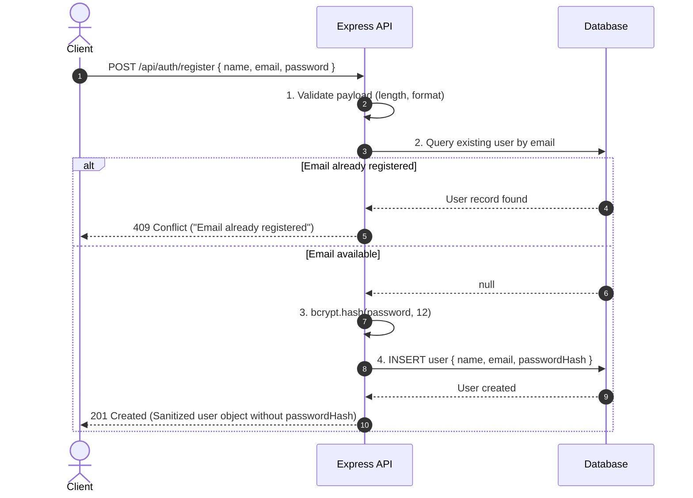

# 🔐 Password Authentication

> A comprehensive, production-oriented guide to password authentication, cryptographic hashing, salting, verification flows, and defensive architecture in backend systems.

---

## 1. Definition

**Password Authentication** is a credential-based verification mechanism where a user asserts their identity to a server by providing a registered public identifier (such as an email address or username) alongside a secret value (a password).

```text
User
 │
 │  POST /api/auth/login
 │  Body: { email, password }
 ▼
Server
 │
 ├── 1. Locate user record by identifier
 ├── 2. Retrieve securely stored password hash
 └── 3. Cryptographically compare incoming password with stored hash
         │
         ├── Mismatch ──► 401 Unauthorized ("Invalid credentials")
         │
         └── Match    ──► 200 OK (Issue Session / JWT)
```

The server's role is not to decrypt or read the password, but to mathematically verify whether the secret supplied during the current request corresponds to the secret established during registration.

---

## 2. The Core Problem: The Danger of Plaintext Storage

Consider a user registering with:
```text
Email:    krishna@example.com
Password: Password@123
```

### ❌ The Critical Vulnerability: Plaintext Storage
Storing passwords directly in the database:
```json
{
  "email": "krishna@example.com",
  "password": "Password@123"
}
```
If the database is leaked—through SQL/NoSQL injection, insecure backups, unauthorized internal access, or log exposure—every user account is immediately compromised. Furthermore, because users frequently reuse passwords across multiple services, a single breach enables **credential stuffing attacks** against all of their external accounts.

### ✅ The Industry Standard: One-Way Hash Storage
```text
"Password@123" ──► [ Password Hashing Algorithm ] ──► "$2b$12$e8...Jq9Pq" ──► Database
```
The database stores strictly the **cryptographic hash**, ensuring that even with complete database access, an attacker cannot immediately read the plaintext passwords.

---

## 3. What is Hashing? (Hashing vs Encryption)

**Hashing is a one-way mathematical transformation that converts an input of arbitrary length into a fixed-length character sequence (digest).**

```text
Plaintext Input ──► [ One-Way Hash Function ] ──► Fixed-Length Hash Output
```

### Critical Distinction: Hashing $\neq$ Encryption

```text
HASHING (One-Way)
Input: "SecretPass" ──► [ Hashing ] ──► "$2b$12$..." ──► (Mathematically Irreversible)

ENCRYPTION (Two-Way)
Plaintext ──► [ Encryption (with Key) ] ──► Ciphertext ──► [ Decryption (with Key) ] ──► Plaintext
```

* **Encryption** is reversible: designed to protect data in transit or at rest where the authorized party needs to restore the original plaintext using a decryption key.
* **Hashing** is irreversible: designed for verification. A server never needs to read the user's password; it only needs to confirm that two inputs produce identical outputs.

---

## 4. Password Hashing with Bcrypt

In Node.js and Express backends, **Bcrypt** is the established industry standard for password hashing.

### Installation
```bash
npm install bcrypt
```

### Basic Syntax
```javascript
const bcrypt = require('bcrypt');

const plainPassword = 'Password@123';
const saltRounds = 12; // Cost factor

const hash = await bcrypt.hash(plainPassword, saltRounds);
console.log(hash);
// Output: $2b$12$K8F7wQ... (60-character string)
```

### The Cost Factor (Work Factor / Salt Rounds)
The integer `12` represents the **cost factor ($2^R$)**:
* A cost factor of `10` runs $2^{10} = 1,024$ internal rounds of key expansion.
* A cost factor of `12` runs $2^{12} = 4,096$ rounds (taking approximately 250ms–350ms on modern server hardware).

Password algorithms are **intentionally slow**. While a 250ms calculation is imperceptible to a single user logging in, it prevents attackers from running billions of guesses per second on high-performance GPUs.

---

## 5. What is a Salt and Why is it Necessary?

A **Salt** is a cryptographically secure, pseudo-random string generated uniquely for every single password before it is hashed.

$$\text{Final Hash} = \text{HashFunction}(\text{Password} + \text{Salt})$$

### The Problem Without Salt (Identical Hashes & Rainbow Tables)
If two users share the same password:
```text
User A: "Password@123" ──► Hash: 5e884898da28047151d0e56f8dc6292773603d0d6aabbdd62a11ef721d1542d8
User B: "Password@123" ──► Hash: 5e884898da28047151d0e56f8dc6292773603d0d6aabbdd62a11ef721d1542d8
```
Attackers use **Rainbow Tables** (precomputed databases containing billions of common passwords and their corresponding hashes) to perform instant reverse lookups in $O(1)$ time.

### The Solution With Salt
```text
User A: "Password@123" + Salt_A ("#9x!L2@z") ──► Hash: $2b$12$#9x!L2@z...AbC789
User B: "Password@123" + Salt_B ("$7v*R9?k") ──► Hash: $2b$12$$7v*R9?k...Zyx123
```
* Even with identical passwords, each user produces a **completely unique hash**.
* Precomputed rainbow tables become completely useless because an attacker would need to precompute a distinct table for every single user's salt.
* **Bcrypt manages salts automatically:** It embeds the salt directly into the resulting 60-character string, eliminating the need for a separate `salt` column in the database.

---

## 6. User Registration Flow



---

## 7. Registration Implementation (Express.js)

```javascript
const express = require('express');
const bcrypt = require('bcrypt');

const router = express.Router();
const users = []; // Mock database collection

router.post('/register', async (req, res) => {
  try {
    const { name, email, password } = req.body;

    // 1. Validate input completeness and complexity
    if (!name || !email || !password) {
      return res.status(400).json({ error: 'All fields are required' });
    }

    if (password.length < 8) {
      return res.status(400).json({ error: 'Password must be at least 8 characters long' });
    }

    // 2. Check for duplicate account
    const normalizedEmail = email.toLowerCase().trim();
    const existingUser = users.find(u => u.email === normalizedEmail);

    if (existingUser) {
      return res.status(409).json({ error: 'User already exists' });
    }

    // 3. Hash password with cost factor 12
    const passwordHash = await bcrypt.hash(password, 12);

    // 4. Persist user record
    const newUser = {
      id: `usr_${Date.now()}`,
      name: name.trim(),
      email: normalizedEmail,
      passwordHash,
      createdAt: new Date()
    };
    users.push(newUser);

    // 5. Send sanitized response (NEVER return passwordHash)
    return res.status(201).json({
      success: true,
      message: 'User registered successfully',
      user: {
        id: newUser.id,
        name: newUser.name,
        email: newUser.email
      }
    });

  } catch (error) {
    return res.status(500).json({ error: 'Internal server error' });
  }
});
```

---

## 8. Login Verification & `bcrypt.compare()` Mechanics

During authentication, a client sends the plaintext password. The server must verify this input against the stored hash.

### Why You Cannot Just Hash Again
You **cannot** execute:
```javascript
// ❌ WRONG: Always evaluates to false!
bcrypt.hash(incomingPassword, 12) === storedHash
```
Because `bcrypt.hash()` generates a **brand-new random salt** on every execution, hashing the correct password a second time yields an entirely different hash string.

### How `bcrypt.compare()` Operates Internally
```javascript
const isMatch = await bcrypt.compare(incomingPassword, storedHash);
```
1. It reads the algorithm version, cost factor, and the exact salt directly from the stored hash string.
2. It hashes the candidate password using that **extracted salt and cost factor**.
3. It compares the newly computed hash with the stored hash using a **constant-time byte comparison** (preventing timing attacks).

---

## 9. Login Implementation (Express.js)

```javascript
router.post('/login', async (req, res) => {
  try {
    const { email, password } = req.body;

    // 1. Validate payload
    if (!email || !password) {
      return res.status(400).json({ error: 'Email and password are required' });
    }

    // 2. Locate user
    const normalizedEmail = email.toLowerCase().trim();
    const user = users.find(u => u.email === normalizedEmail);

    // 3. Verify user existence and password validity
    // (Note: In production, compare with a dummy hash if user is null to prevent timing leakage)
    if (!user) {
      return res.status(401).json({ error: 'Invalid credentials' });
    }

    const isPasswordValid = await bcrypt.compare(password, user.passwordHash);

    if (!isPasswordValid) {
      return res.status(401).json({ error: 'Invalid credentials' });
    }

    // 4. Authenticated successfully: Establish session / issue JWT
    return res.status(200).json({
      success: true,
      message: 'Login successful',
      user: {
        id: user.id,
        name: user.name,
        email: user.email
      }
    });

  } catch (error) {
    return res.status(500).json({ error: 'Internal server error' });
  }
});
```

---

## 10. Account Enumeration Defense ("Invalid credentials")

A critical backend design principle is preventing **Account Enumeration (CWE-204)**:

| Scenario | Insecure Response | Secure Response |
| :--- | :--- | :--- |
| **Email does not exist** | `404 User does not exist` ❌ | `401 Invalid credentials` ✅ |
| **Email exists, but password wrong** | `401 Incorrect password` ❌ | `401 Invalid credentials` ✅ |

If the API indicates whether an email address exists, automated botnets can test millions of scraped email lists to harvest confirmed accounts, which are subsequently targeted with phishing or targeted credential stuffing.

---

## 11. Complete Defensive Architecture Beyond Bcrypt

A robust password authentication system requires a complete defense-in-depth pipeline:

```text
Password Authentication Architecture
│
├── 1. Input Validation (Sanitize, reject overly short passwords)
├── 2. Cryptographic Storage (Bcrypt / Argon2id with CSPRNG Salt)
├── 3. Transport Security (HTTPS mandatory - HSTS headers)
├── 4. Generic Responses (Consistent 401 "Invalid credentials")
├── 5. Brute-Force Defense (Rate limiting by IP and by target account)
├── 6. Account Lifecycle Management (Change Password, Opaque Password Reset)
└── 7. Session Delivery (httpOnly, Secure, SameSite cookies)
```

### A. Change Password Flow (Authenticated)
1. User provides `currentPassword` and `newPassword`.
2. The server verifies `currentPassword` using `bcrypt.compare()`.
3. If valid, the server hashes `newPassword` and updates the record.

### B. Forgot Password Flow (Unauthenticated Reset)
1. User submits their email.
2. The server generates a high-entropy, cryptographically random **opaque token** (e.g. `crypto.randomBytes(32).toString('hex')`).
3. The server saves the **hash of that reset token** in the database alongside a short expiration window (e.g., 15 minutes).
4. An email with a reset link is sent: `https://app.com/reset-password?token=<rawToken>`.
5. When submitted, the token is verified and immediately invalidated (single-use).

### C. Rate Limiting (Brute-Force Mitigation)
Without rate limiting, an attacker can submit thousands of dictionary guesses per minute.
* Enforce a sliding window rate limit: e.g. Maximum 5 failed attempts per 15-minute window per IP and target email.

### D. Transport Layer Security (HTTPS)
Passwords sent across unencrypted HTTP networks can be intercepted in plaintext via packet sniffing and man-in-the-middle (MITM) attacks. **Plain HTTP must never be used for credentials in production.**

---

## 12. Authentication vs Authorization Distinction

```text
PASSWORD AUTHENTICATION (AuthN)
"Who are you?"
User presents credentials ──► Server validates proof of identity ──► Identity Established

AUTHORIZATION (AuthZ)
"What are you permitted to do?"
Authenticated user requests an action ──► Server checks permissions/roles ──► Allowed (200) or Denied (403)
```

* **Authentication:** Occurs first at login. (Failure code: `401 Unauthorized`).
* **Authorization:** Occurs on every subsequent request to protected resources. (Failure code: `403 Forbidden`).

---

## 13. Interview Masterclass: Structured Answers

### Primary Question: *"How do you implement secure password authentication in a backend system?"*

**Comprehensive Answer:**
> *"In a secure backend implementation, password authentication begins at registration where I validate input formats and enforce password length and complexity. I never store plaintext passwords. I hash the password using a memory- or compute-hard Key Derivation Function like Bcrypt or Argon2id with a cost factor calibrated to ~250ms, relying on its CSPRNG salt generation to defeat rainbow tables. The database stores strictly the resulting hash.*  
>  
> *During login, I locate the user by their normalized identifier and use `bcrypt.compare()` to verify the incoming plaintext password against the stored hash in constant time. If authentication fails, I consistently return a generic `401 Invalid credentials` to prevent account enumeration.*  
>  
> *In production, password authentication also requires defense-in-depth: mandatory HTTPS to encrypt credentials in transit, sliding-window rate limiting to prevent brute-force attacks, and secure one-time opaque tokens for password resets."*

### Key Cross-Questions & Crisp Answers:

#### 1. "Why not use encryption instead of hashing for passwords?"
> *"Because passwords only require verification, not recovery. Encryption is two-way and requires managing a decryption key; if that key is compromised, every stored password is exposed. Hashing is a one-way trapdoor function that verifies identity without ever exposing the original plaintext."*

#### 2. "Why can't you compare passwords using `bcrypt.hash(input) === storedHash`?"
> *"Because Bcrypt generates a brand-new random salt on every invocation. Hashing the exact same password again produces an entirely different hash string. Instead, `bcrypt.compare()` extracts the original salt directly from the stored hash and performs a constant-time comparison."*

#### 3. "What is the difference between a Salt and a Pepper?"
> *"A Salt is unique per user, generated via CSPRNG, and stored directly in the database alongside the hash to defeat rainbow tables. A Pepper is an application-wide secret key stored outside the database (in environment variables or a Key Management Service/HSM) appended to passwords before hashing. If the database alone is breached, attackers cannot crack hashes without the pepper."*
