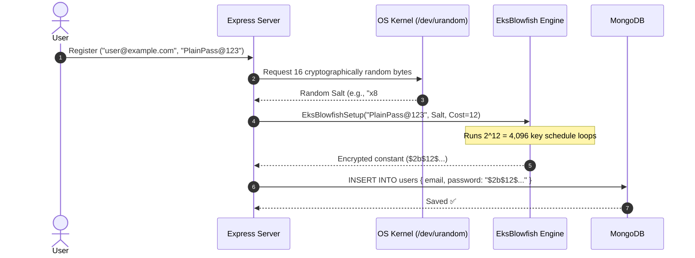

# 🔑 Password Hashing, Salt & Bcrypt - Complete Guide & Mechanics

> **Category:** Backend  
> **Topic:** Password Authentication  
> **Concept:** Hashing, Salt & Bcrypt  
> **Prerequisites:** Cryptographic basics, Node.js, Mongoose/MongoDB

---

## ⚡ 2-Minute Interview Cheatsheet (TL;DR)

| Concept | Technical Summary for Interviews |
| :--- | :--- |
| **Hashing vs Encryption** | Encryption is **two-way** (decryptable with key); Hashing is a **one-way** mathematical trapdoor function (irreversible). |
| **Why Not SHA-256?** | SHA-256 is designed for extreme throughput ($O(1)$ memory). Modern GPUs calculate **billions of SHA-256 hashes/sec**, making brute-force trivial. |
| **Salt** | Cryptographically random string (min 16 bytes via CSPRNG) added to passwords before hashing. Defeats **Rainbow Table** precomputation attacks by ensuring identical passwords yield distinct hashes. |
| **Bcrypt Mechanics** | Based on Bruce Schneier's **EksBlowfish** (Expensive Key Schedule). Uses a cost factor $2^R$ to deliberately slow down computation. |
| **Bcrypt 72-Byte Limit** | Bcrypt strictly truncates inputs at **72 bytes**. Characters beyond 72 are ignored. Mitigated by pre-hashing with SHA-256. |
| **Mongoose Best Practice** | Use `pre('save')` hook with `isModified('password')` and set `select: false` on password field. |

---

## 1. What is it?

**Password Hashing** is the process of passing a user's plain-text password through a one-way cryptographic algorithm to produce a fixed-length string (the "hash" or "digest").

```text
Plaintext: "SuperSecret@2026"  ──► [ Bcrypt Algorithm ] ──► "$2b$12$e8...Jq9Pq"
```

A properly generated password hash cannot be reversed. During login, the server never decrypts the stored hash; instead, it hashes the incoming password using the exact same salt and parameters, then verifies if the two digests match.

### Anatomical Breakdown of a Bcrypt String:

```text
 $2b$12$N9qo8uLOickgx2ZMRZoMyeIjZAgcfl7p92ldGxad68LJZdL17lhWy
 └──┘ └┘ └────────────────────┘ └────────────────────────────┘
  │    │            │                         │
Prefix Cost    Salt (22 chars)          Hash (31 chars)
```
* **Prefix (`$2b$`):** Identifies the Bcrypt algorithm version.
* **Cost Factor (`$12$`):** Logarithmic work factor ($2^{12} = 4,096$ iterations).
* **Salt (22 base64 chars):** The 128-bit random salt used for this specific password.
* **Hash (31 base64 chars):** The resulting cipher output (184 bits).

---

## 2. Why do we need it?

### A. The Hazard of Plaintext Storage
If a database storing plaintext passwords is breached via SQL/NoSQL injection or stolen backups, **all user accounts are instantly compromised across all web services** (credential stuffing).

### B. Why General Cryptographic Hashes (MD5, SHA-1, SHA-256) Fail
1. **Hardware Discrepancy:** SHA-256 was designed for rapid data verification. It requires almost zero RAM (only 8x 32-bit CPU registers).
2. **GPU & ASIC Parallelism:** A modern GPU has over 16,000 arithmetic logic units (ALUs). An attacker can compute **over 100 billion SHA-256 hashes per second**.
3. **Rainbow Tables:** Precomputed lookup tables of billions of hashes allow an attacker to crack unsalted hashes in $O(1)$ constant time without performing any calculations.

### C. The Solution: Key Derivation Functions (KDFs)
Algorithms like **Bcrypt** and **Argon2** are designed to be **deliberately slow and computationally expensive**, rendering massive GPU cracking economically and physically infeasible.

---

## 3. How does it work?



### 1. Salting Mechanism
A salt makes every hash unique. If 1,000 users choose `"password123"`, each user receives a distinct CSPRNG-generated salt. Consequently, the database contains **1,000 completely different hashes**. Rainbow tables become completely useless because the attacker would have to generate a distinct rainbow table for every single user's unique salt.

### 2. The Work Factor (Cost)
Bcrypt uses $2^{\text{cost}}$ rounds.
* Cost 10 = $2^{10} = 1,024$ iterations (~80ms).
* Cost 12 = $2^{12} = 4,096$ iterations (~250ms–350ms).
* For a legitimate user, 250ms during login is unnoticeable. For an attacker testing 100 million guesses, 250ms per guess translates to **nearly 800 years of compute time** on a single machine!

### 3. The 72-Byte Truncation Limit
* EksBlowfish key expansion has an internal limit of **72 bytes**.
* If a user submits an 85-character password, Bcrypt discards characters 73 through 85.
* **Production Fix:** If extremely long passwords (passphrases) must be supported, pre-hash the password with `SHA-256` (producing a fixed 32-byte digest) before passing it to Bcrypt:
  $$\text{Bcrypt}(\text{SHA256}(\text{password}), \text{salt})$$

---

## 4. Syntax & Basic Structure (Node.js)

```javascript
const bcrypt = require('bcryptjs'); // or 'bcrypt'

// 1. Generate Salt + Hash (Manual 2-step approach)
const salt = await bcrypt.genSalt(12);
const hashedPassword = await bcrypt.hash('userSecretPassword', salt);

// 2. Generate Salt + Hash (Combined 1-step approach)
const hashedPasswordAuto = await bcrypt.hash('userSecretPassword', 12);

// 3. Compare Password during Login
// Bcrypt extracts the salt and cost from the stored hash automatically!
const isMatch = await bcrypt.compare('candidatePassword', hashedPassword);
```

---

## 5. Practical Implementation (MERN Stack / Mongoose)

```javascript
// models/User.js
const mongoose = require('mongoose');
const bcrypt = require('bcryptjs');

const userSchema = new mongoose.Schema({
  email: {
    type: String,
    required: true,
    unique: true,
    lowercase: true,
    trim: true
  },
  password: {
    type: String,
    required: true,
    minlength: 8,
    select: false // 🔥 Never return password in queries by default
  }
});

// Pre-save hook: Triggered on user.save()
userSchema.pre('save', async function (next) {
  // CRITICAL: Only hash if password was actually modified or is new!
  if (!this.isModified('password')) return next();

  const salt = await bcrypt.genSalt(12);
  this.password = await bcrypt.hash(this.password, salt);
  next();
});

// Instance Method: Reusable comparison helper
userSchema.methods.comparePassword = async function (candidatePassword) {
  return await bcrypt.compare(candidatePassword, this.password);
};

module.exports = mongoose.model('User', userSchema);
```

---

## 6. Important Points & Best Practices

1. **Never use `Math.random()` for Salts:** Always rely on CSPRNG (`crypto.randomBytes` or Bcrypt's internal salt generator).
2. **Cost Factor Calibration:** Set cost factor so hashing takes between **200ms and 350ms** on your production hardware.
3. **Password Pepper (Defense-in-Depth):** A pepper is an application-wide secret key stored in environment variables or AWS KMS (never in the database).
   $$\text{Hash} = \text{Bcrypt}(\text{Password} + \text{Salt} + \text{Pepper})$$
   Even if the database is leaked, attackers cannot crack hashes without the pepper key.
4. **Timing Attack Protection:** Bcrypt's `compare` method internally uses **constant-time byte comparison** to prevent CPU branch-prediction timing attacks.

---

## 7. Common Mistakes & Pitfalls

| Mistake | Consequence | Proper Fix |
| :--- | :--- | :--- |
| **Omitting `isModified('password')`** | Updating non-password fields (e.g. `user.name = 'John'; await user.save()`) re-hashes the already-hashed password, locking the user out! | Always check `if (!this.isModified('password')) return next();`. |
| **Forgetting `select: false`** | `User.find()` returns password hashes in API responses, leaking them to clients. | Add `select: false` in Mongoose schema. |
| **Using `findOneAndUpdate()` for passwords** | Direct query updates bypass Mongoose `save` middleware! | Use `user = await User.findById(); user.password = newPass; await user.save();`. |
| **Using Fast Hashes (MD5/SHA-256)** | Trivial GPU brute-forcing. | Strictly use Bcrypt or Argon2id. |

---

## 8. Related Concepts

* **Argon2id:** The modern memory-hard gold standard algorithm, immune to GPU/ASIC attacks.
* **PBKDF2:** NIST-approved KDF based on HMAC iterations (used in Django and crypto wallets).
* **Constant-Time Comparison (`crypto.timingSafeEqual`):** Bitwise comparison avoiding early-exit execution paths.
