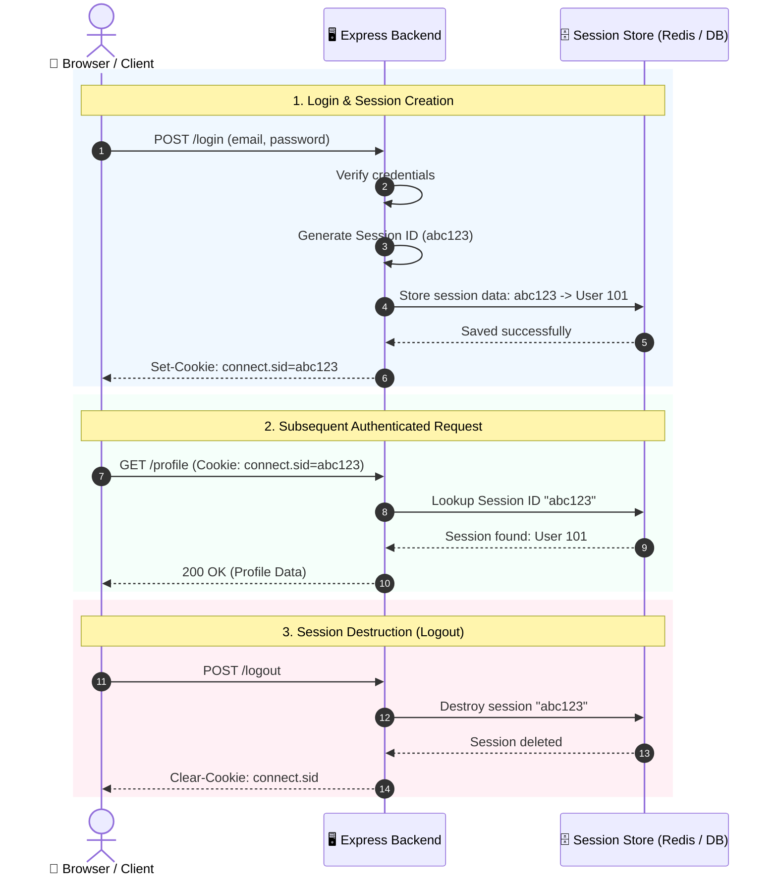
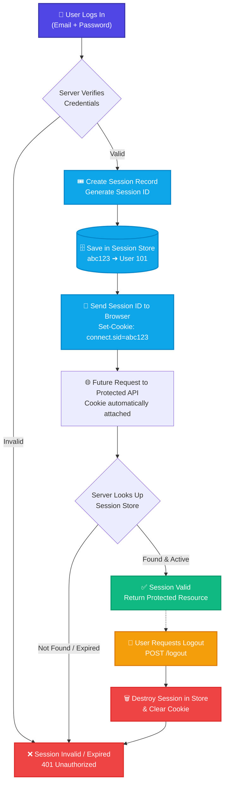

# 🎟️ Session ID & Session-Based Authentication

> Guide to session-based authentication, Session IDs, session stores, cookie management, and Express.js implementation.

---

## 1. Session-Based Authentication

### Definition
**Session-Based Authentication** is an authentication mechanism in which the server creates and maintains an active session for an authenticated user.

After a successful login, the server generates a unique **Session ID** and sends it to the client, typically through a cookie.

The client sends this Session ID with subsequent requests, allowing the server to identify and authenticate the user.

### Simple Definition
> In session-based authentication, the server stores user login information in a server-side session and issues a Session ID to the client. The client transmits this Session ID on subsequent requests to be recognized.

---

## 2. What is a Session?

A **Session** is server-side data representing the current authenticated state of a user.

Example:
```text
Session Record
-------------------------
Session ID: abc123
User ID:    101
Created:    10:00 AM
Expires:    10:30 AM
```

The session informs the server:
> "Session `abc123` belongs to User 101."

---

## 3. What is a Session ID?

### Definition
A **Session ID** is a unique identifier used to reference a user's session stored on the server.

Example:
```text
Session ID = abc123xyz789
```

The Session ID itself generally does not contain complete user data. Instead, it acts as a pointer:

```text
Session ID (abc123xyz789)
          ↓
Lookup in Session Store
          ↓
User ID = 101
```

> **Session ID is an identifier; session data is stored on the server.**

---

## 4. Why Do We Need a Session ID?

HTTP is stateless. When a user logs in successfully, the server must recognize that user on subsequent requests.

* **Without a Session:**
  ```text
  Request 1 → Login
  Request 2 → Who is this user?
  Request 3 → Who is this user?
  ```
  The server cannot remember the authenticated state.

* **With a Session ID:**
  ```text
  Login ──► Create Session ──► Generate Session ID ──► Client sends Session ID ──► Server identifies user
  ```

---

## 5. Complete Session Authentication Flow



---

## 6. Login Process

When a client submits:
```http
POST /login
Content-Type: application/json

{
  "email": "krishna@gmail.com",
  "password": "123456"
}
```

The server performs:
```text
1. Find user by email
       ↓
2. Verify password
       ↓
3. Create session
       ↓
4. Generate Session ID
       ↓
5. Store session in session store
       ↓
6. Send Session ID to client in a cookie
```

* **Server-side:** Session Store maps `abc123` $\to$ `User ID 101`.
* **Client-side:** Browser sets cookie `connect.sid = abc123`.

---

## 7. How Does the Next Request Work?

When the user requests a protected resource:
```http
GET /profile
Cookie: connect.sid=abc123
```

The server:
```text
Session ID (abc123)
       ↓
Search Session Store
       ↓
Session found (User ID = 101)
       ↓
User authenticated
       ↓
Return profile data
```

---

## 8. Session Store

A **Session Store** is the storage mechanism where server-side session information resides.

```text
Session ID       User ID
-------------------------
abc123           101
xyz789           205
pqr456           310
```

Session data can be stored in:
* **Memory:** Simple applications and local development.
* **Redis:** Fast in-memory key-value store commonly used in production to share sessions across multiple instances.
* **Database:** MongoDB, PostgreSQL, MySQL via dedicated session collections/tables.

---

## 9. Cookie

A **Cookie** is a small piece of data stored by the browser that is automatically included with matching HTTP requests according to browser rules.

In session-based authentication, the Session ID is transmitted via cookies:
```http
Set-Cookie: connect.sid=abc123
```
The browser stores it and automatically attaches it to subsequent requests:
```http
GET /profile
Cookie: connect.sid=abc123
```

Relationship:
```text
Session ──(identified by)──► Session ID ──(stored/transmitted via)──► Cookie
```

---

## 10. Session ID vs Cookie

These are two distinct concepts:

* **Session ID:** The unique value identifying the server-side session (`abc123`).
* **Cookie:** The browser storage and transmission mechanism (`connect.sid=abc123`).

> **Session ID is the value; a Cookie is the mechanism used to store and send that value.**

---

## 11. Session-Based Authentication in Express

### Installation
```bash
npm install express express-session
```

### Setup Configuration
```javascript
const express = require("express");
const session = require("express-session");

const app = express();

app.use(express.json());

app.use(
  session({
    secret: process.env.SESSION_SECRET || "supersecretkey",
    resave: false,
    saveUninitialized: false,
    cookie: {
      httpOnly: true,
      secure: false, // Set to true in production with HTTPS
      maxAge: 30 * 60 * 1000 // 30 minutes
    }
  })
);
```

### Configuration Options
* **`secret`:** Used by middleware to sign and tamper-proof the session ID cookie.
* **`resave: false`:** Prevents saving the session back to the store if it was never modified.
* **`saveUninitialized: false`:** Prevents storing empty, uninitialized sessions in the store.
* **`httpOnly: true`:** Forbids client-side JavaScript from reading the cookie, mitigating XSS attacks.
* **`secure`:** Ensures cookies are only sent over HTTPS (`false` for local dev, `true` for production).

---

## 12. Login Implementation

```javascript
app.post("/login", async (req, res) => {
  const { email, password } = req.body;

  const user = await User.findOne({ email });
  if (!user) {
    return res.status(401).json({ message: "Invalid credentials" });
  }

  const isPasswordCorrect = await bcrypt.compare(password, user.password);
  if (!isPasswordCorrect) {
    return res.status(401).json({ message: "Invalid credentials" });
  }

  // Store user identifier in session
  req.session.userId = user._id;

  res.json({ message: "Login successful" });
});
```

`req.session.userId = user._id` links the current session to the logged-in user.

---

## 13. Protected Route

```javascript
app.get("/profile", async (req, res) => {
  if (!req.session.userId) {
    return res.status(401).json({ message: "Authentication required" });
  }

  const user = await User.findById(req.session.userId).select("-password");
  res.json({ user });
});
```

Flow:
```text
GET /profile ──► Session Cookie ──► express-session ──► Session Found?
                                                           ├── YES ──► Find User ──► Return Profile
                                                           └── NO  ──► 401 Unauthorized
```

---

## 14. Logout

During logout, the server destroys the session:

```javascript
app.post("/logout", (req, res) => {
  req.session.destroy((err) => {
    if (err) {
      return res.status(500).json({ message: "Logout failed" });
    }

    res.clearCookie("connect.sid");
    res.json({ message: "Logout successful" });
  });
});
```

Flow:
```text
Logout ──► Destroy Session ──► Session ID invalidated ──► Subsequent Protected Requests return 401
```

---

## 15. Session Expiration

Sessions can be configured with an explicit lifespan:
```javascript
cookie: {
  maxAge: 30 * 60 * 1000 // 30 minutes
}
```
After expiration, the session is purged and the user must re-authenticate.

---

## 16. Session-Based Authentication vs JWT

| Feature | Session-Based Authentication | JWT Authentication |
| :--- | :--- | :--- |
| **State Storage** | Server maintains session state | Stateless: token carries claims |
| **Client Transmits** | Session ID | JWT |
| **Validation** | Verified via server-side session store | Verified via cryptographic signature |
| **Transmission** | Usually via cookies | Commonly via `Authorization: Bearer` header |
| **Revocation** | **Instant:** server can destroy session | Requires revocation list / blacklist |
| **Store Requirement** | Requires session store (Redis/DB) | No session store required for basic verification |
| **Token Format** | Opaque identifier | Structured Base64Url-encoded parts |

---

## 17. Session ID vs Access Token

```text
Session ID ≠ Access Token
```

* **Session ID (`abc123xyz`):** An opaque identifier that points to a server-side session record.
* **Access Token (JWT):** A self-contained credential carrying claims presented directly to access protected APIs.

---

## 18. Advantages of Session-Based Authentication

1. **Easy Session Revocation:** The server can instantly terminate a session at any time.
2. **Centralized State Control:** Server controls login time, expiration, and user status.
3. **Natural Browser Integration:** Works seamlessly with standard browser cookies.

---

## 19. Disadvantages

1. **Server-Side State Overhead:** The server must store and track session records.
2. **Session Store Dependency:** Multi-server deployments require a shared store like Redis:
   ```text
   Server 1 ──┐
   Server 2 ──┼──► Redis Shared Session Store
   Server 3 ──┘
   ```
3. **Scaling Considerations:** Horizontal scaling requires centralized session synchronization.

---

## 20. Security Considerations

Session IDs are sensitive credentials.

Recommended cookie settings:
```javascript
cookie: {
  httpOnly: true, // Prevents JavaScript access (anti-XSS)
  secure: true,   // Transmitted only over HTTPS
  sameSite: "lax" // Defends against CSRF
}
```

> **Critical Rule:** Never place sensitive data such as passwords inside a Session ID.

---

## 21. Complete Mental Model (Architecture Map)


