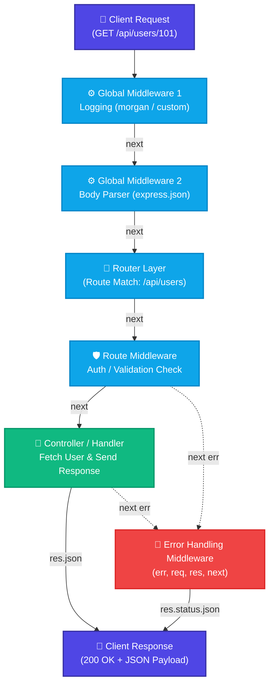

# 🚀 Day 08: Express.js Architecture & Modular Routing

> A production-grade, interview-focused guide to Express.js architecture, the Request-Response Lifecycle, the Middleware Pipeline (`next()`), and Modular Routing design.

---

## ⚡ 2-Minute Interview Cheatsheet (TL;DR)

| Concept | Direct Interview Definition (Say This) |
| :--- | :--- |
| **What is Express.js?** | *"Express.js is a minimal, unopinionated, fast web framework for Node.js that provides a robust layer of HTTP utilities and middleware pipeline on top of Node's native `http` module."* |
| **Request-Response Lifecycle** | *"The execution journey of an HTTP request from client dispatch, sequential processing through a pipeline of middleware functions, reaching the route controller, and sending back an HTTP response."* |
| **What is Middleware?** | *"A middleware is a function that has access to the `req` object, `res` object, and the `next` function in the application's request-response cycle. It can execute code, modify `req`/`res`, end the cycle, or pass control."* |
| **What is `next()`?** | *"A callback function that passes execution control to the next middleware or route handler in the registered stack."* |
| **What does `next(err)` do?** | *"Calling `next()` with an argument tells Express an error occurred, immediately bypassing all standard middleware and jumping directly to the registered 4-argument Error-Handling Middleware."* |
| **`express.Router()`** | *"An isolated instance of middleware and routes, acting as a 'mini-application' that enables modular, decoupled, and maintainable routing across large backend codebases."* |
| **What is `ERR_HTTP_HEADERS_SENT`?** | *"A runtime error thrown when code attempts to send HTTP headers or a response body after a response has already been sent to the client (typically caused by forgetting `return res.json(...)` or calling `next()` after sending a response)."* |

---

## 1. What is Express.js?

### 🎯 Authoritative Interview Definition:
> **Express.js** is a minimal, unopinionated, and flexible Node.js web application framework that abstracts Node's low-level built-in `http` module, providing a powerful routing engine, middleware pipeline, and HTTP utility wrappers.

### Why Not Just Use Native Node.js `http`?

In native Node.js:
```javascript
// Native Node.js HTTP server - tedious and manual
const http = require('http');

const server = http.createServer((req, res) => {
  if (req.url === '/api/users' && req.method === 'GET') {
    res.writeHead(200, { 'Content-Type': 'application/json' });
    res.end(JSON.stringify([{ id: 1, name: 'Alice' }]));
  } else if (req.url === '/api/users' && req.method === 'POST') {
    let body = '';
    req.on('data', chunk => { body += chunk.toString(); });
    req.on('end', () => {
      const data = JSON.parse(body);
      res.writeHead(201, { 'Content-Type': 'application/json' });
      res.end(JSON.stringify({ success: true, user: data }));
    });
  } else {
    res.writeHead(404);
    res.end('Not Found');
  }
});
```

### The Express.js Improvement:
1. **Automatic URL & Method Parsing:** Express provides intuitive HTTP method helpers (`app.get`, `app.post`, `app.put`, `app.delete`).
2. **Built-In Middleware Pipeline:** Seamless handling of parsing (`express.json()`), CORS, compression, and authentication.
3. **Response Convenience Helpers:** Methods like `res.json()`, `res.status()`, and `res.sendFile()` replace manual buffer streaming and header management.
4. **Dynamic Route Matching:** Express parses URL parameters like `/users/:id` into `req.params` out of the box.

---

## 2. Express.js Architecture: Under the Hood

Express is architected around the **Pipeline / Onion Design Pattern**:



### Key Architectural Takeaway:
* An Express application is essentially a **stack of middleware functions executed in sequential order**.
* The request enters at the top of the stack, travels down through each middleware function, hits the target route handler (controller), and sends a response back to the client.
* If any middleware throws an error or calls `next(err)`, Express skips all remaining standard middleware and diverts execution directly to the **Error Handling Middleware**.

---

## 3. The Request & Response Lifecycle Deep Dive

Every incoming HTTP connection in Express is wrapped into two primary objects:
1. **`req` (Request Object):** Represents the incoming HTTP request (headers, query params, URL route params, body).
2. **`res` (Response Object):** Represents the outgoing HTTP response used to set status codes, cookies, headers, and payload data.

### Request Object (`req`) Cheat Sheet:
* **`req.params`:** Object containing route parameters matched from URL path definitions (e.g., `/users/:id` $\to$ `req.params.id`).
* **`req.query`:** Object containing query string parameters (e.g., `/search?role=admin&limit=10` $\to$ `req.query.role`, `req.query.limit`).
* **`req.body`:** Parsed request body payload (populated by `express.json()` or `express.urlencoded()`).
* **`req.headers`:** Key-value map of incoming HTTP headers (e.g., `req.headers.authorization`).
* **`req.method`:** HTTP verb used (e.g., `GET`, `POST`, `DELETE`).
* **`req.originalUrl`:** The complete original URL path requested by the client.

### Response Object (`res`) Cheat Sheet:
* **`res.status(code)`:** Sets the HTTP status code (e.g., `res.status(200)`, `res.status(404)`). Returns `res` for chaining.
* **`res.json(data)`:** Sets `Content-Type: application/json`, serializes the JavaScript object into JSON, and ends the response cycle.
* **`res.send(body)`:** Sends arbitrary string, Buffer, or HTML content and ends the response cycle.
* **`res.cookie(name, val, opts)`:** Sets an HTTP response cookie header (`Set-Cookie`).
* **`res.redirect(url)`:** Issues an HTTP 301/302 redirect to a target URL.
* **`res.end()`:** Ends the response process immediately without sending payload data.

> [!CAUTION]
> **The Hanging Request Pitfall:**  
> If a middleware or route handler neither calls `next()` nor sends a response (via `res.json()`, `res.send()`, etc.), the HTTP request will **hang indefinitely** until the client's network timeout threshold is reached!

---

## 4. The Middleware Pattern & `next()` Function

### 🎯 Authoritative Interview Definition:
> **Middleware** is a function that sits in the execution path of an Express application, having access to the incoming Request object (`req`), outgoing Response object (`res`), and the `next` callback in the cycle.

```javascript
const myMiddleware = (req, res, next) => {
  // 1. Perform logic or inspection
  console.log(`${req.method} ${req.originalUrl}`);

  // 2. Attach data to req for downstream handlers
  req.requestTime = Date.now();

  // 3. Pass control to the next middleware in stack
  next();
};
```

### What Can a Middleware Do?
1. **Execute arbitrary code** (logging, metrics tracking, header inspection).
2. **Modify the request or response object** (e.g., attaching `req.user` after decoding a JWT).
3. **End the request-response cycle early** (e.g., returning `401 Unauthorized` if unauthenticated).
4. **Call the `next()` middleware function** in the stack.

### What Does `next()` Actually Do?
* `next()` is a pointer/callback that tells Express: *"I am done with my processing. Execute the next registered middleware in the pipeline."*
* If `next()` is omitted, the execution pipeline halts.

### What Does `next(err)` Do?
* If you pass an argument to `next(err)` (anything other than the string `'route'`), Express treats the current request as an error.
* Express **bypasses all remaining regular middleware and router handlers** and jumps straight to the registered **Error-Handling Middleware** (`(err, req, res, next)`).

---

## 5. The 5 Types of Express Middleware (Interview Essential)

Interviewers frequently ask candidates to name and categorize Express middleware types. Always list these five:

```text
Express Middleware Types
├── 1. Application-Level Middleware (app.use, app.get applied globally)
├── 2. Router-Level Middleware (router.use, scoped to specific sub-routes)
├── 3. Error-Handling Middleware (Defined strictly with 4 arguments)
├── 4. Built-In Middleware (express.json, express.urlencoded, express.static)
└── 5. Third-Party Middleware (cors, helmet, morgan, cookie-parser)
```

### 1. Application-Level Middleware
Bound to an instance of the `app` object using `app.use()` or `app.METHOD()`. Runs on every request matching the path:
```javascript
app.use((req, res, next) => {
  console.log(`[LOG]: ${req.method} ${req.url}`);
  next();
});
```

### 2. Router-Level Middleware
Bound to an instance of `express.Router()`. Scoped strictly to that router module:
```javascript
const router = express.Router();

// This middleware runs ONLY on routes mounted to this router
router.use((req, res, next) => {
  console.log('Router-specific check executed');
  next();
});
```

### 3. Error-Handling Middleware
Defined **strictly with 4 arguments**: `(err, req, res, next)`. Express identifies error-handling middleware specifically by its function `length` property (`fn.length === 4`):
```javascript
app.use((err, req, res, next) => {
  console.error(err.stack);
  res.status(err.statusCode || 500).json({
    success: false,
    message: err.message || 'Internal Server Error'
  });
});
```

### 4. Built-In Middleware
Shipped directly inside Express:
* **`express.json()`**: Parses incoming JSON payloads and attaches them to `req.body`.
* **`express.urlencoded({ extended: true })`**: Parses URL-encoded form submissions.
* **`express.static('public')`**: Serves static assets (HTML, CSS, images).

### 5. Third-Party Middleware
Installed via NPM to enhance security and utility:
```bash
npm install helmet cors morgan
```
```javascript
const helmet = require('helmet');
const cors = require('cors');
const morgan = require('morgan');

app.use(helmet());          // Sets secure HTTP response headers
app.use(cors());            // Handles Cross-Origin Resource Sharing
app.use(morgan('dev'));     // Production-grade HTTP request logger
```

---

## 6. Modular Routing Architecture (`express.Router()`)

In production enterprise backends, routes should never be dumped into a single monolithic `server.js` or `index.js`. Instead, routes are structured modularly using `express.Router()`.

### Why Modular Routing?
* **Separation of Concerns:** Each business domain (Users, Products, Orders) manages its own routes and controllers.
* **Isolated Middleware:** Router-level middleware can protect an entire domain (e.g., `userRouter.use(protect)`) without polluting global routes like health checks or public landing pages.
* **Clean Codebase:** Keeps `server.js` minimal (under 50 lines) as an orchestration file.

### Production Enterprise Folder Structure:
```text
src/
├── server.js               # App entrypoint & global middleware orchestration
├── routes/
│   ├── index.js            # Master API router (v1 aggregator)
│   ├── userRoutes.js       # User domain routes
│   └── productRoutes.js    # Product domain routes
└── controllers/
    ├── userController.js   # User request handlers
    └── productController.js# Product request handlers
```

### Modular Implementation:

#### 1. Define Sub-Router (`routes/userRoutes.js`):
```javascript
const express = require('express');
const router = express.Router();

// Router-level middleware
router.use((req, res, next) => {
  req.routerTimestamp = Date.now();
  next();
});

// Route chaining via router.route()
router.route('/')
  .get((req, res) => res.json({ message: "Get all users" }))
  .post((req, res) => res.status(201).json({ message: "Create user" }));

router.route('/:id')
  .get((req, res) => res.json({ message: `Get user ${req.params.id}` }))
  .delete((req, res) => res.json({ message: `Delete user ${req.params.id}` }));

module.exports = router;
```

#### 2. Mount in Master App (`server.js`):
```javascript
const express = require('express');
const userRoutes = require('./routes/userRoutes');

const app = express();
app.use(express.json());

// Mount the modular router onto a base URL prefix
app.use('/api/v1/users', userRoutes);

app.listen(3000, () => console.log('Server running on port 3000'));
```

---

## 7. Common Pitfalls & Critical Anti-Patterns

### ❌ Pitfall 1: Forgetting `return` Before `res.json()` or `next()`
```javascript
// ❌ WRONG: Execution continues after res.status().json()
app.get('/api/users/:id', (req, res, next) => {
  if (!req.params.id) {
    res.status(400).json({ error: "Missing ID" });
  }
  // This line runs ANYWAY, triggering: Error [ERR_HTTP_HEADERS_SENT]!
  res.json({ user: "Alice" });
});

// ✅ CORRECT: Always return to prevent downstream execution
app.get('/api/users/:id', (req, res, next) => {
  if (!req.params.id) {
    return res.status(400).json({ error: "Missing ID" });
  }
  return res.json({ user: "Alice" });
});
```

### ❌ Pitfall 2: Ordering Middleware Incorrectly
Middleware executes strictly in the order it is registered with `app.use()`:
```javascript
// ❌ WRONG: express.json() registered AFTER routes! req.body will be undefined!
app.use('/api/users', userRoutes);
app.use(express.json());

// ✅ CORRECT: Parser registered BEFORE routes
app.use(express.json());
app.use('/api/users', userRoutes);
```

### ❌ Pitfall 3: Placing Error Middleware Before Routes
The 4-argument error-handling middleware must **always be registered last**, after all routes:
```javascript
// ❌ WRONG: Error handler placed before routes
app.use((err, req, res, next) => { ... });
app.use('/api/users', userRoutes);

// ✅ CORRECT: Error handler placed at the very end of the pipeline
app.use('/api/users', userRoutes);
app.use((err, req, res, next) => { ... });
```
