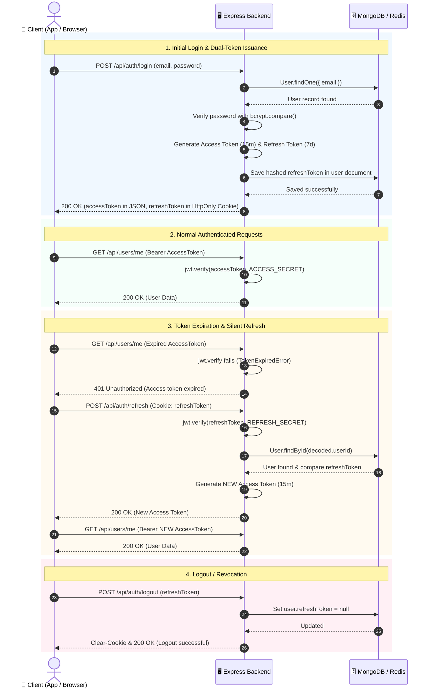
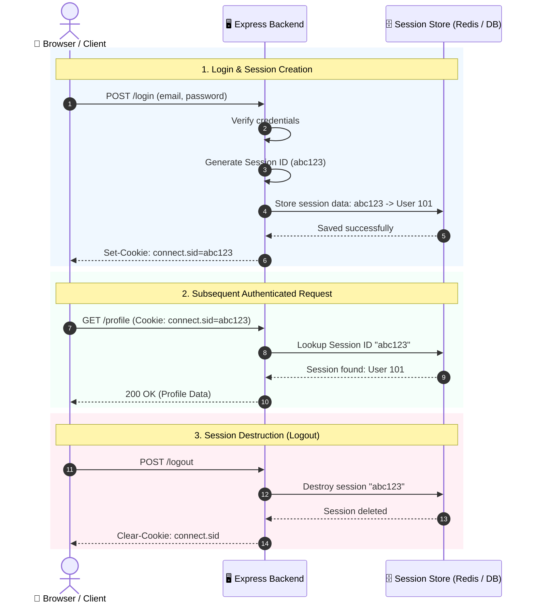
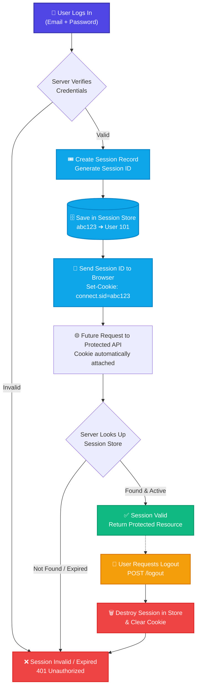

# 🔄 Day 21: Refresh Tokens & Stateful Session Management

> A comprehensive, production-grade guide covering dual-token lifecycles (Access & Refresh Tokens), Refresh Token Rotation (RTR), stateful session-based authentication, session stores (Redis vs DB), cookie security, and token revocation strategies.

---

## ⚡ 2-Minute Interview Cheatsheet (TL;DR)

| Concept | Key Point to Mention in Interview |
| :--- | :--- |
| **Access Token** | Short-lived (10–15 mins), stateless credential sent with every request to access protected APIs. |
| **Refresh Token** | Long-lived (7–30 days), stateful credential used exclusively to request newly minted Access Tokens. |
| **Refresh Token Rotation (RTR)** | Issuing a brand-new Refresh Token on every refresh call while invalidating the old one. If an old token is reused, all tokens for the user are immediately revoked. |
| **Session-Based Authentication** | Stateful authentication where the server stores user session data (RAM/Redis/DB) and issues an opaque **Session ID** (`connect.sid`) inside a cookie. |
| **Session ID vs Cookie** | The **Session ID** is the identifier value on the server; the **Cookie** is the browser mechanism used to transport that value automatically. |
| **Session Stores** | **MemoryStore** (local dev only) vs **Redis** (production standard: sub-millisecond, shared across instances) vs **Database** (persistent disk storage). |
| **Security Flags** | Both Session IDs and Refresh Tokens must use **`HttpOnly`** (anti-XSS), **`Secure`** (HTTPS only), and **`SameSite=Lax/Strict`** (anti-CSRF). |

---

# PART 1: ACCESS TOKENS & REFRESH TOKENS

---

## 1. Access Token

### Definition
An **Access Token** is a short-lived token used by a client to access **protected resources/APIs** after successful authentication.

> **In simple words:** An Access Token proves to the server that the user is authenticated and permitted to access protected APIs.

### Characteristics
* **Lifespan:** Short-lived (usually 10 to 15 minutes).
* **Usage:** Sent with every authenticated API call (in the `Authorization: Bearer <token>` header or a secure cookie).
* **Validation:** Stateless — verified mathematically by the backend using a secret or public key with zero database lookup.
* **Expiration:** Becomes invalid once expired.

```text
Login ──► Email + Password verified ──► Access Token issued ──► Client accesses protected APIs
```

---

## 2. Refresh Token

### Definition
A **Refresh Token** is a long-lived token used exclusively to obtain a **new Access Token** when the current Access Token expires, without requiring the user to re-enter their password.

> **In simple words:** The primary job of a Refresh Token is to obtain a new Access Token.

### Characteristics
* **Lifespan:** Long-lived (7 to 30 days).
* **Usage:** Sent strictly to the `/api/auth/refresh` endpoint.
* **Validation:** Stateful — verified against a stored record in MongoDB or Redis to ensure it has not been revoked.
* **Storage:** Stored in a secure `HttpOnly` cookie to protect it against XSS attacks.

```text
Access Token expires ──► Client sends Refresh Token ──► Server verifies ──► New Access Token issued
```

---

## 3. Access Token vs Refresh Token

| Property | Access Token | Refresh Token |
| :--- | :--- | :--- |
| **Primary Purpose** | Access protected APIs & resources | Obtain a new Access Token |
| **Lifespan** | Very short (10–15 minutes) | Long (7–30 days) |
| **Storage (Client)** | In-memory / HTTP Bearer header / Secure Cookie | Strictly `HttpOnly`, `Secure` Cookie |
| **Storage (Server)** | Stateless (not in database) | Stateful (stored in MongoDB / Redis) |
| **Usage Frequency** | Sent on every authenticated request | Sent strictly on token renewal |
| **Revocation** | Difficult to revoke immediately (expires on its own) | Instantly revokable by deleting from DB/Redis |

---

## 4. End-to-End Dual-Token Sequence Diagram



---

## 5. Complete Dual-Token Architecture Flowchart


---

## 6. Refresh Token Rotation (RTR) & Automatic Reuse Detection

**Refresh Token Rotation (RTR)** is a security best practice where the authorization server issues a **brand-new Refresh Token** every single time an existing Refresh Token is redeemed. The previous Refresh Token is immediately invalidated.

### Automatic Reuse Detection:
1. An attacker intercepts Token Pair A.
2. The legitimate user uses Token Pair A $\to$ The server issues Token Pair B.
3. The attacker subsequently attempts to use spent Token Pair A.
4. The server detects that an already-invalidated token was submitted (**Reuse Detected!**).
5. **Immediate Defense:** The backend purges the entire token family from the database, instantly terminating all active sessions for that user across all devices.

---

## 7. Frontend Silent Refresh (Auto-Refresh)

Frontend clients use HTTP interceptors (e.g., Axios response interceptors) to implement silent refresh:
1. The client catches `401 Unauthorized` errors.
2. It pauses pending requests and calls `POST /api/auth/refresh`.
3. If successful, it updates the stored Access Token and replays the original failed requests seamlessly without disrupting the user.

---

# PART 2: STATEFUL SESSION-BASED AUTHENTICATION

---

## 8. What is Session-Based Authentication?

### Definition
**Session-Based Authentication** is a stateful authentication mechanism where the server creates and maintains an active session record for an authenticated user on the server.

After a successful login:
1. The server generates a unique, opaque **Session ID**.
2. The server stores the user's authenticated state in a **Session Store** (Memory, Redis, or Database).
3. The server sends this Session ID back to the client inside an `HttpOnly` **Cookie** (`connect.sid`).
4. On subsequent requests, the browser automatically attaches this cookie, enabling the server to look up the session and identify the user.

### Simple Definition
> In session-based authentication, the server stores login information on the backend and issues a Session ID to the client via a cookie. The client sends this Session ID with each request to remain logged in.

---

## 9. What is a Session & Session ID?

### What is a Session?
A **Session** is server-side data representing the current authenticated state of a user:
```text
Session Record in Server/Redis
-----------------------------------
Session ID:   abc123xyz789
User ID:      101
Role:         admin
Created At:   10:00 AM
Expires At:   10:30 AM
```

### What is a Session ID?
A **Session ID** is an opaque string that points to the session record:
```text
Session ID (abc123xyz789) ──► Lookup in Store ──► Returns { userId: 101, role: 'admin' }
```
> The Session ID itself does **not** contain user data; it is merely an unforgeable reference pointer.

---

## 10. Why Do We Need a Session ID?

Because HTTP is inherently **stateless**. Without sessions:
```text
Request 1: POST /login  ──► "You are User 101"
Request 2: GET /profile ──► "Who are you? (HTTP has forgotten)"
Request 3: GET /orders  ──► "Who are you?"
```

With a Session ID:
```text
Login ──► Create Session ──► Return Session ID in Cookie ──► Cookie sent automatically ──► Server identifies User 101
```

---

## 11. Complete Session Authentication Flow (Sequence Diagram)



---

## 12. Session Architecture Map (Mental Model Flowchart)



---

## 13. Session Stores: Memory vs Redis vs Database

Where does the server store session records?

```text
Session ID (abc123xyz) ──► Stored in HttpOnly Cookie
                                    │
                                    ▼
                         Resolved via Session Store:
                         ├── MemoryStore (Local Dev only)
                         ├── Redis (Production Gold Standard: In-Memory RAM)
                         └── MongoDB / SQL (Persistent database collection)
```

### Detailed Store Comparison:

| Feature | MemoryStore (RAM) | Redis Store | MongoDB / SQL Store |
| :--- | :--- | :--- | :--- |
| **Read/Write Latency** | $<0.1$ms (Ultra-fast) | 1–2ms (Extremely fast) | 5–15ms (Disk I/O) |
| **Persistence** | None (Lost on server restart) | Configurable (AOF / RDB snapshots) | Full ACID disk durability |
| **Multi-Server Scaling** | ❌ Fails without sticky sessions | ✅ Shared centrally across all instances | ✅ Shared centrally across instances |
| **TTL Automatic Expiry**| Manual cleanup required | ✅ Native key expiration (`EXPIRE`) | Handled via TTL indexes |
| **Production Suitability**| ❌ **Dev Only (Memory Leak risk)** | ⭐ **Industry Gold Standard** | Moderate traffic / small apps |

---

## 14. Session ID vs Cookie

These are two distinct concepts:

* **Session ID:** The unique value identifying the server-side session (`abc123`).
* **Cookie:** The browser storage and transmission mechanism (`connect.sid=abc123`).

> **Session ID is the value; a Cookie is the mechanism used to store and send that value.**

Relationship:
```text
Session ──(identified by)──► Session ID ──(stored/transmitted via)──► Cookie
```

---

## 15. Express.js Implementation with `express-session`

### Setup Configuration
```javascript
const express = require("express");
const session = require("express-session");

const app = express();
app.use(express.json());

app.use(
  session({
    secret: process.env.SESSION_SECRET || "supersecretkey",
    resave: false,             // Do not save session back if unmodified
    saveUninitialized: false,  // Do not store empty, uninitialized sessions
    cookie: {
      httpOnly: true,          // Defends against XSS
      secure: false,           // Set to true in production with HTTPS
      maxAge: 30 * 60 * 1000   // 30 minutes expiration
    }
  })
);
```

### 1. Login Implementation
```javascript
app.post("/login", async (req, res) => {
  const { email, password } = req.body;

  const user = await User.findOne({ email });
  if (!user || !(await bcrypt.compare(password, user.password))) {
    return res.status(401).json({ message: "Invalid credentials" });
  }

  // Bind authenticated user identity to session
  req.session.userId = user._id;
  res.json({ message: "Login successful" });
});
```

### 2. Protected Route
```javascript
app.get("/profile", async (req, res) => {
  if (!req.session.userId) {
    return res.status(401).json({ message: "Authentication required" });
  }

  const user = await User.findById(req.session.userId).select("-password");
  res.json({ user });
});
```

### 3. Logout Implementation
```javascript
app.post("/logout", (req, res) => {
  req.session.destroy((err) => {
    if (err) return res.status(500).json({ message: "Logout failed" });
    res.clearCookie("connect.sid");
    res.json({ message: "Logout successful" });
  });
});
```

---

# PART 3: ARCHITECTURAL COMPARISONS & SUMMARY

---

## 16. Session-Based Authentication vs JWT Authentication

| Feature | Session-Based Authentication | JWT (Token-Based) Authentication |
| :--- | :--- | :--- |
| **State Storage** | **Stateful:** Server stores active records in Redis/DB | **Stateless:** Token self-contains user claims |
| **Client Transmits** | Opaque Session ID (`connect.sid`) | Signed JWT string (`Header.Payload.Signature`) |
| **Validation Method** | Lookup in session store on every request | Cryptographic signature verification (Zero DB calls) |
| **Revocation** | **Instant:** Server simply deletes the session | Harder: requires TTL expiry, `tokenVersion`, or Redis blacklist |
| **Horizontal Scaling** | Requires shared store (Redis) | Native: any microservice can verify token with secret/key |
| **Network Overhead** | Tiny cookie header (~40 bytes) | Larger header payload (~500–1000 bytes) |
| **Ideal For** | Monoliths, traditional web apps, B2B dashboards | Microservices, mobile applications, distributed APIs |

---

## 17. Session ID vs Access Token

```text
Session ID ≠ Access Token
```

* **Session ID (`abc123xyz`):** An opaque identifier that points to a server-side session record.
* **Access Token (JWT):** A self-contained credential carrying claims presented directly to access protected APIs.

---

## 18. Token Revocation Strategies Summary

1. **Database Delete / Invalidation:** Remove the user's `refreshToken` field in MongoDB or Redis on logout.
2. **`tokenVersion` Counter:** Increment `user.tokenVersion` in the database to instantly invalidate all previously issued tokens upon password reset.
3. **Redis Blacklist with TTL:** Add invalidated tokens to a Redis key-value store with an expiration matching the token's remaining lifespan.
