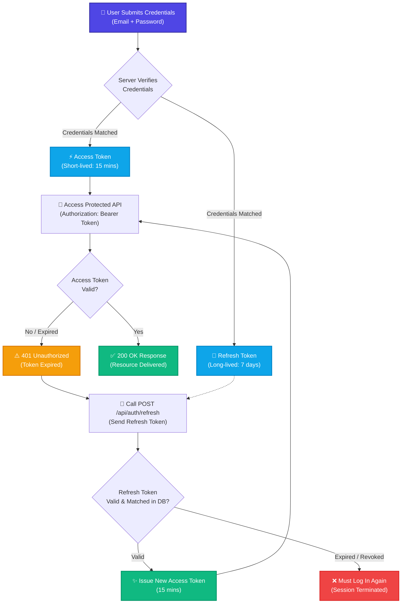
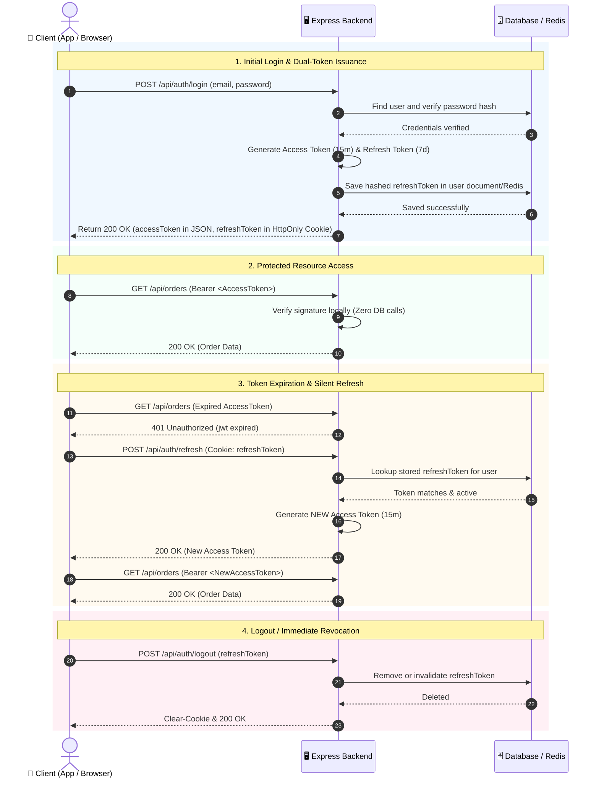

# 🔄 Day 21: Refresh Tokens & Session Management

> Comprehensive guide to dual-token architecture (Access & Refresh Tokens), Refresh Token Rotation (RTR), session management, session store alternatives (Redis vs DB), and token revocation strategies.

---

## 1. Fundamentals of Dual-Token Architecture

In modern backend architectures, pairing a short-lived Access Token with a long-lived Refresh Token provides the optimal balance between **stateless performance** and **security**.



---

## 2. Access Token vs Refresh Token

| Property | Access Token | Refresh Token |
| :--- | :--- | :--- |
| **Purpose** | Authorize access to protected APIs | Obtain a newly minted Access Token |
| **Lifespan** | Very short (e.g., 10 to 15 minutes) | Long (e.g., 7 to 30 days) |
| **Storage (Client)** | In-memory / HTTP Bearer header / Secure Cookie | Strictly in `HttpOnly`, `Secure` cookie or secure storage |
| **Storage (Server)** | Stateless (not stored in database) | Stateful (stored in MongoDB or Redis with user reference) |
| **Usage Frequency** | Sent with every authenticated API call | Sent strictly to `/api/auth/refresh` endpoint |
| **Revocation** | Difficult to revoke immediately (expires on its own) | Instantly revokable by deleting from database/Redis |

---

## 3. End-to-End Sequence Diagram (Full Lifecycle)



---

## 4. Refresh Token Rotation (RTR) & Reuse Detection

**Refresh Token Rotation (RTR)** is a security standard where the authorization server issues a **brand-new Refresh Token** every single time a Refresh Token is used to obtain a new Access Token. The old Refresh Token is immediately invalidated.

### Automatic Reuse Detection
If an attacker steals a Refresh Token:
1. The legitimate user or the attacker uses the token $\to$ Server issues Token Pair B.
2. The other party tries to reuse the already-spent Token Pair A.
3. The backend detects **token reuse**: `"A spent token was presented!"`.
4. **Immediate Action:** The server automatically purges the **entire token family** from the database, instantly terminating all active sessions for that user across all devices.

---

## 5. Session Management & Session Store Alternatives

In traditional and B2B web applications, **Stateful Sessions** are used instead of purely stateless tokens.

```text
Session ID (Opaque string: abc123xyz) ──► Stored in HttpOnly Cookie
                                                   │
                                                   ▼
                                        Resolved via Session Store:
                                        ├── MemoryStore (Local Dev only)
                                        ├── Redis (Production standard: Fast in-memory RAM)
                                        └── MongoDB / SQL (Persistent database collection)
```

### Session Store Comparison

| Session Store | Read/Write Latency | Persistence | Horizontal Scaling | Production Suitability |
| :--- | :--- | :--- | :--- | :--- |
| **In-Memory (RAM)** | Extremely fast ($<0.1$ms) | None (lost on restart) | ❌ Broken (requires sticky sessions) | ❌ Local development only |
| **Redis Store** | Ultra fast (1–2ms) | Configurable (AOF/RDB) | ✅ Shared cache across all server instances | ⭐ **Industry Gold Standard** |
| **MongoDB / SQL Store** | Slower (5–15ms) | High (durable on disk) | ✅ Centralized database | Suitable for low-to-medium traffic |

---

## 6. Secure Cookie Transport Checklist

Whether transporting a Session ID or a Refresh Token, cookies must enforce the following flags:

```javascript
res.cookie('refreshToken', token, {
  httpOnly: true,  // Forbids JavaScript from reading document.cookie (anti-XSS)
  secure: true,    // Transmitted strictly over encrypted HTTPS connections
  sameSite: 'lax', // Defends against Cross-Site Request Forgery (CSRF)
  maxAge: 7 * 24 * 60 * 60 * 1000 // 7 days expiration
});
```

---

## 7. Token Revocation Strategies Summary

1. **Database Delete / Invalidation:** Remove the user's `refreshToken` field in MongoDB or Redis on logout.
2. **`tokenVersion` Counter:** Increment `user.tokenVersion` in the database to instantly invalidate all previously issued tokens upon password reset.
3. **Redis Blacklist with TTL:** Add invalidated tokens to a Redis key-value store with an expiration matching the token's remaining lifespan.
