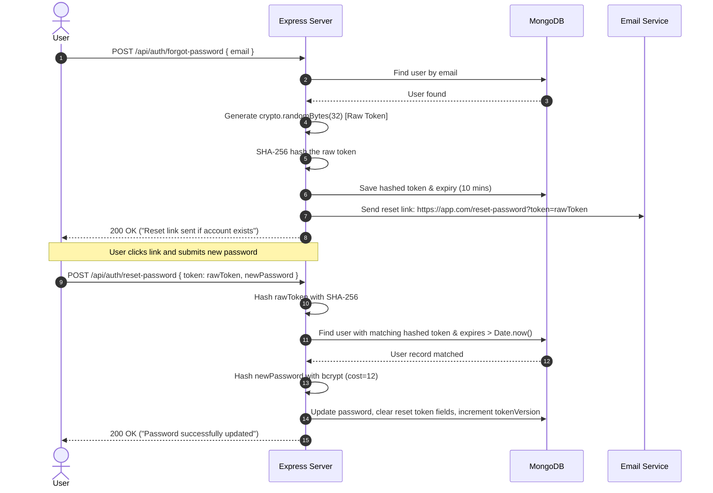

# 🛡️ Day 22: Authorization, RBAC & Lifecycle Workflows

> Complete architectural guide to Role-Based Access Control (RBAC), permission mapping, resource ownership verification (BOLA/IDOR defense), password resets, and email verification workflows.

---

## ⚡ 2-Minute Interview Cheatsheet (TL;DR)

| Concept | Key Technical Point to Mention |
| :--- | :--- |
| **Authorization (AuthZ)** | Verifying whether an authenticated identity has permission to perform an action on a specific resource. |
| **HTTP Status Code** | **`403 Forbidden`** (Identity is authenticated, but permission is denied). Distinct from `401 Unauthorized`. |
| **RBAC Mechanism** | Permissions are assigned to **Roles** (e.g. `admin`, `editor`, `user`), and Roles are assigned to **Users**. |
| **Resource Ownership (BOLA / IDOR)** | RBAC alone is insufficient. Always enforce ownership at the database query level (`where userId = req.user.id`). |
| **Password Reset Security** | Generate a high-entropy CSPRNG token (`crypto.randomBytes(32)`), save its **SHA-256 hash** in the database with a 10-minute expiry, and email the raw token. |
| **Email Verification** | Send a temporary hashed token; upon confirmation, mark `isEmailVerified: true` and invalidate the token. |

---

## 1. What is Authorization (AuthZ)?

**Authorization** is the policy evaluation process that occurs **after** authentication. It answers:
> *"Is this authenticated user permitted to perform this specific action on this target resource?"*

```text
Incoming Request ──► [ AuthN Middleware ] ──► Identity Verified (req.user)
                              │
                              ▼
                     [ AuthZ Middleware ] ──► Role/Permission Valid?
                              │
                    ┌─────────┴─────────┐
                    ▼                   ▼
            ALLOW: next()       DENY: 403 Forbidden
```

---

## 2. Role-Based Access Control (RBAC) Architecture

In RBAC, individual permissions are grouped into Roles. Users are granted one or more roles.

```text
  [ User ] ────────► Assigned to ────────► [ Role: 'editor' ]
                                                    │
                                                    ▼
                                           Granted Permissions:
                                           ├── post:create
                                           ├── post:edit
                                           └── post:publish
```

---

## 3. Express RBAC Middleware Pattern

A higher-order middleware closure (`restrictTo`) enforces role authorization cleanly across routes:

```javascript
// middlewares/authMiddleware.js
const restrictTo = (...allowedRoles) => {
  return (req, res, next) => {
    // req.user was populated by prior authentication middleware
    if (!req.user || !allowedRoles.includes(req.user.role)) {
      return res.status(403).json({
        success: false,
        message: 'Forbidden: You do not have permission to perform this action.'
      });
    }
    next();
  };
};

// Application
router.delete('/products/:id', protect, restrictTo('admin'), deleteProductController);
```

---

## 4. Resource Ownership Verification (BOLA / IDOR Defense)

A major API vulnerability (**Broken Object Level Authorization**) occurs when role checks pass (e.g., user has role `'user'`), but the server fails to verify if the user actually **owns** the target record.

```javascript
// ❌ VULNERABLE: Any user can edit anyone's document by guessing the ID!
router.put('/documents/:id', protect, async (req, res) => {
  const doc = await Document.findByIdAndUpdate(req.params.id, req.body);
  res.json(doc);
});

// ✅ SECURE: Scoped DB query strictly enforces ownership
router.put('/documents/:id', protect, async (req, res) => {
  const filter = { _id: req.params.id };

  // Admins can edit any document, regular users can ONLY edit their own!
  if (req.user.role !== 'admin') {
    filter.ownerId = req.user._id;
  }

  const doc = await Document.findOneAndUpdate(filter, req.body, { new: true });
  if (!doc) {
    return res.status(404).json({ message: 'Document not found or unauthorized' });
  }

  res.json(doc);
});
```

---

## 5. Password Reset Workflow (Secure Token Architecture)



### Critical Security Rule:
**Never store raw reset tokens in the database.** If the database is leaked, attackers could read pending reset tokens and hijack accounts. Storing `crypto.createHash('sha256').update(rawToken).digest('hex')` ensures stolen databases cannot be used to execute resets.

---

## 6. Email Verification Workflow

```text
1. User Signs Up:
   - Save user with `isEmailVerified: false`.
   - Generate random verification token via `crypto.randomBytes(32)`.
   - Store SHA-256 hashed token and 24-hour expiration in DB.
   - Send verification email: `https://app.com/verify-email?token=<rawToken>`.

2. User Clicks Verification Link:
   - Endpoint: `GET /api/auth/verify-email?token=...`
   - Hash incoming raw token with SHA-256.
   - Find user where `emailVerificationToken === hashedToken` AND `tokenExpires > Date.now()`.
   - Update user: `isEmailVerified = true`, `emailVerificationToken = undefined`.
   - Return 200 OK ("Email verified successfully").
```

---

## 7. Common Pitfalls & Security Summary

| Pitfall | Security Risk | Proper Mitigation |
| :--- | :--- | :--- |
| **Only checking roles in Frontend** | Bypassed via direct Postman/cURL requests | Enforce RBAC middleware on all Express routes |
| **Missing Ownership Checks** | BOLA / IDOR data tampering | Scope queries: `{ _id: id, ownerId: req.user._id }` |
| **Storing Raw Reset Tokens in DB** | DB leak exposes immediate account takeover | Store only SHA-256 hashes of reset tokens |
| **Reusable Reset Tokens** | Token reuse attacks | Invalidate token immediately upon first successful reset |
